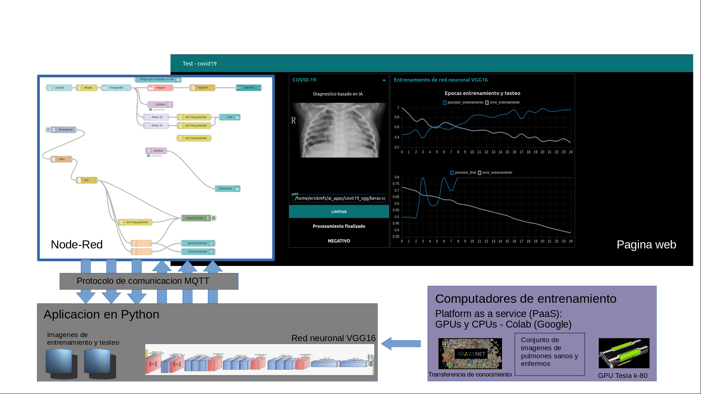

# covid19 detection with X-ray chest images
This is an intent for developing a web app with node-red including an VGG16 model trained with kaggle's real xray chest images dataset

#An overview of the project

